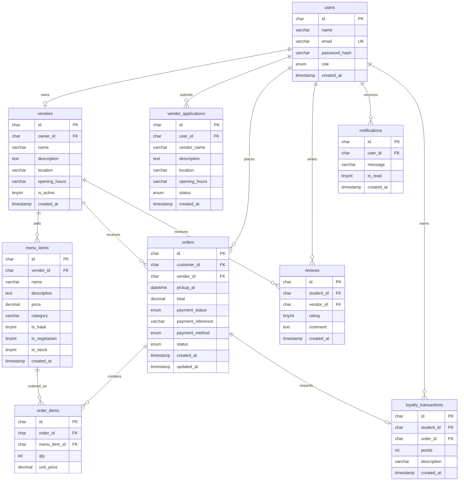

# CampusEats ER Diagram

```mermaid
erDiagram
    users ||--o| vendors : owns
    users ||--o{ vendor_applications : submits
    users ||--o{ orders : places
    users ||--o{ reviews : writes
    users ||--o{ notifications : receives
    users ||--o{ loyalty_transactions : earns

    vendors ||--o{ menu_items : sells
    vendors ||--o{ orders : receives
    vendors ||--o{ reviews : receives

    orders ||--o{ order_items : contains
    orders ||--o| loyalty_transactions : rewards
    menu_items ||--o{ order_items : ordered_as

    users {
        char id PK
        varchar name
        varchar email UK
        varchar password_hash
        enum role
        timestamp created_at
    }

    vendors {
        char id PK
        char owner_id FK
        varchar name
        text description
        varchar location
        varchar opening_hours
        tinyint is_active
        timestamp created_at
    }

    vendor_applications {
        char id PK
        char user_id FK
        varchar vendor_name
        text description
        varchar location
        varchar opening_hours
        enum status
        timestamp created_at
    }

    menu_items {
        char id PK
        char vendor_id FK
        varchar name
        text description
        decimal price
        varchar category
        tinyint is_halal
        tinyint is_vegetarian
        tinyint in_stock
        timestamp created_at
    }

    orders {
        char id PK
        char customer_id FK
        char vendor_id FK
        datetime pickup_at
        decimal total
        enum payment_status
        varchar payment_reference
        enum payment_method
        enum status
        timestamp created_at
        timestamp updated_at
    }

    order_items {
        char id PK
        char order_id FK
        char menu_item_id FK
        int qty
        decimal unit_price
    }

    reviews {
        char id PK
        char student_id FK
        char vendor_id FK
        tinyint rating
        text comment
        timestamp created_at
    }

    notifications {
        char id PK
        char user_id FK
        varchar message
        tinyint is_read
        timestamp created_at
    }

    loyalty_transactions {
        char id PK
        char student_id FK
        char order_id FK
        int points
        varchar description
        timestamp created_at
    }
```

